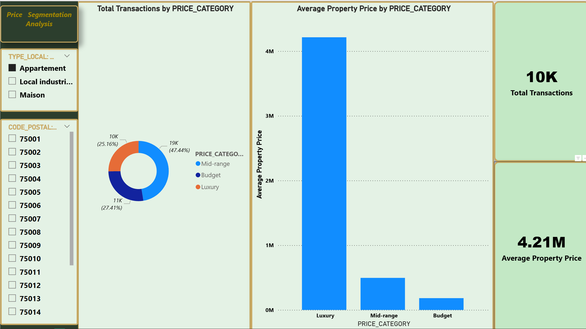
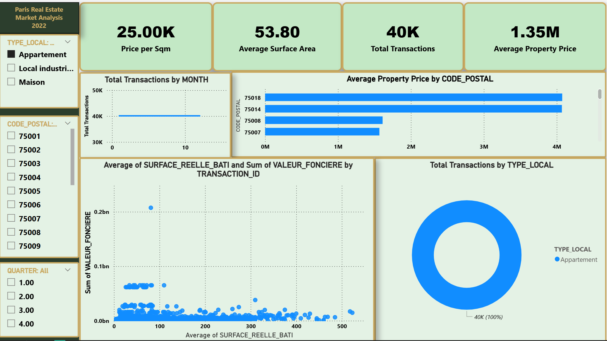
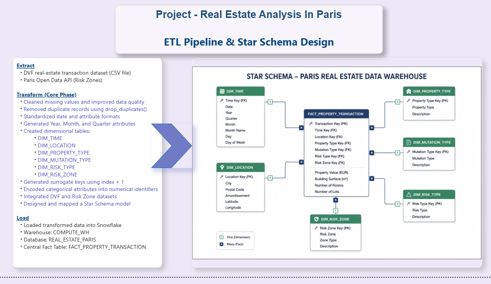
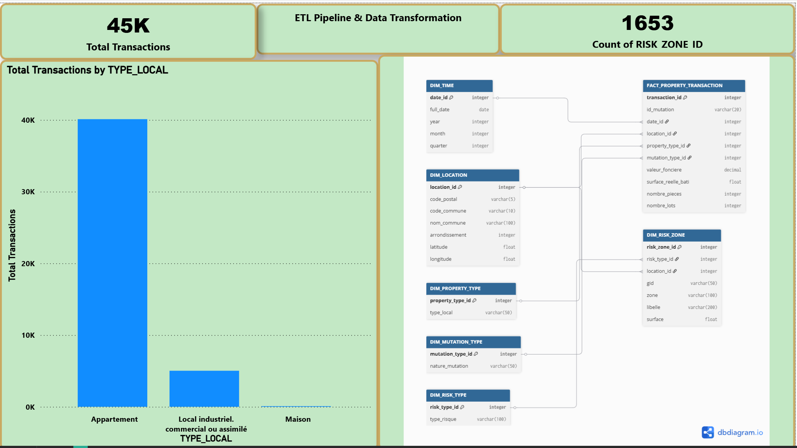
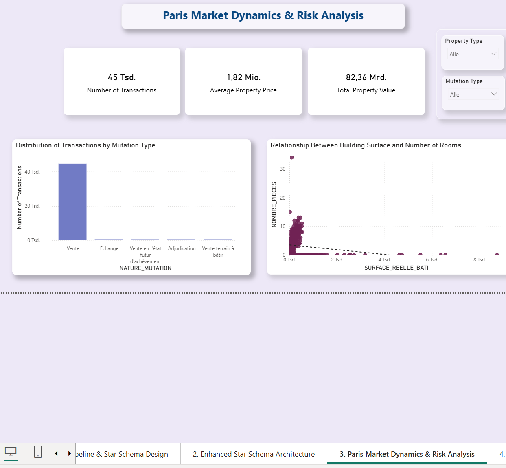
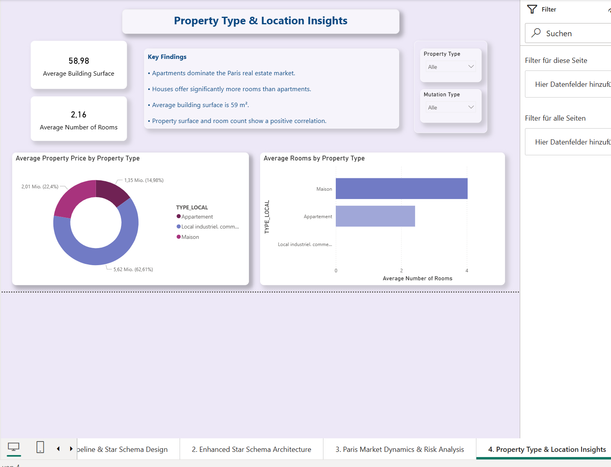

# Paris Real Estate Analytics — End-to-End Data Pipeline

**A complete ETL pipeline from raw French open data to a Snowflake star-schema warehouse and a 5-page Power BI report — analyzing 45,207 Paris property transactions (€82.36bn total value) against flood-risk zoning and geographic distribution.**

🎓 **Capstone project — Analytics Engineer program, Liora × Sorbonne. Defended June 2026.**

---

## The Question

Paris property data is public — but it ships unusable. The DVF national register is 4.67M rows of France-wide transactions. The city's risk zoning lives behind a separate API.

**The task:** bring them into one warehouse and answer what the raw files cannot — *how is the Paris market actually segmented, and what is the price structure inside it?*

---

## Headline Finding

> **Luxury properties account for 28.08% of all Paris transactions — at an average of €5.52M.**

Not a niche. Not the tail. **More than one in four transactions.** A DAX segmentation layer over the fact table splits the market into three bands that are invisible in the flat DVF export:

| Segment | Transactions | Share |
|---|---:|---:|
| Mid-range | 21K | 45.35% |
| **Luxury** | **13K** | **28.08%** |
| Budget | 12K | 26.57% |

The price gap between bands is not gradual — it is a cliff. Luxury averages **€5.52M**; the other two bands sit an order of magnitude below.



---

## Market at a Glance

| | |
|---|---|
| Transactions | **45,207** |
| Total property value | **€82.36bn** |
| Average property price | **€1.82M** |
| Average price per m² | **€30,890** |
| Average building surface | **58.98 m²** |
| Average rooms | **2.16** |
| Risk zones integrated | **1,653** |



**Structural facts the data surfaces:**
- **Apartments dominate** — 40K of 45K transactions (88.72%). Houses are statistically negligible in Paris (0.16%).
- **75008 (8th arrondissement) is the price outlier** — average property price approaching €10M, roughly 2.5× the next-highest postal code.
- Surface and room count correlate positively, but with a long tail of large-surface / low-room commercial units.

---

## The Pipeline



### Extract
| Source | Content | Volume |
|---|---|---|
| [DVF 2022](https://www.data.gouv.fr/) | French property sales register (CSV) | 4.67M rows nationwide |
| Paris Open Data API | Flood-risk zones (PLU Bioclimatique) | 1,653 zones |

### Transform
- DVF filtered from **4.67M → 45,207 Paris transactions**
- Missing values cleaned; exact duplicates removed
- Date and attribute formats standardized; Year / Month / Quarter attributes generated
- Surrogate keys generated; categorical attributes encoded
- DVF and risk-zone datasets joined on location
- Six dimension tables built and mapped to a star model

### Load
- **Snowflake** — warehouse `COMPUTE_WH`, database `REAL_ESTATE_PARIS`
- **Auto-truncate on load** — makes the pipeline idempotent; re-running never produces duplicate rows

---

## Data Model — Star Schema



**1 fact table · 6 dimensions**

| Table | Grain / Role |
|---|---|
| `FACT_PROPERTY_TRANSACTION` | One row per property transaction — property value (EUR), building surface (m²), rooms, lots |
| `DIM_TIME` | Date, year, quarter, month, day of week |
| `DIM_LOCATION` | City, postal code, arrondissement, latitude, longitude |
| `DIM_PROPERTY_TYPE` | Appartement / Maison / Local industriel |
| `DIM_MUTATION_TYPE` | Vente, Échange, Vente en l'état futur, Adjudication, Vente terrain à bâtir |
| `DIM_RISK_TYPE` | Risk classification |
| `DIM_RISK_ZONE` | Zone geometry, surface, label |

Star (not 3NF) was chosen deliberately: the analytical workload is aggregation-heavy and read-only, so denormalized dimensions cut join depth and let Power BI's DAX engine resolve slicers without traversing snowflaked branches.

---

## Analysis Pages

### Market dynamics & risk

Transaction distribution by mutation type (`Vente` overwhelmingly dominant), and the surface-to-rooms relationship with its long commercial tail.

### Property type & location

Average price and room count by property type. Houses offer significantly more rooms than apartments — but are almost absent from the Paris market.

### Geographic distribution

Transaction value mapped across Paris arrondissements. The 8th arrondissement cluster is visible as the dominant bubble.

---

## Stack

| Layer | Tool |
|---|---|
| Language | Python 3.11 |
| Processing | pandas, NumPy, requests |
| Warehouse | Snowflake |
| Modeling | Star schema (1 fact · 6 dimensions) · dbdiagram.io |
| BI | Power BI Desktop (DAX, Power Query) |
| Version control | Git / GitHub |

---

## Repository Contents

```
.
├── notebooks/
│   ├── 01_data_exploration.ipynb      # DVF analysis
│   └── 02_opendata_paris_api.ipynb    # Risk-zone API integration
├── scripts/                           # Production ETL scripts
├── design/                            # Star schema diagram
├── docs/img/                          # Power BI report screenshots
└── requirements.txt
```

> The full Power BI report — 5 pages, star schema, DAX measures, interactive slicers — is available on request (`.pbix`, exceeds GitHub's file-size limit).

## Reproduce

```bash
git clone https://github.com/ahmed4maala-afk/real-estate-paris.git
cd real-estate-paris
python -m venv venv && source venv/bin/activate   # Windows: .\venv\Scripts\Activate.ps1
pip install -r requirements.txt
```

---

## Team

**Ahmed Maala** · **Natalja Voth**
Mentor: **Yaniv** — Data Engineer, Liora

---

## Author

**Ahmed Maala** — Analytics Engineer (Liora × Sorbonne)
📧 ahmed4maala@gmail.com · [GitHub](https://github.com/ahmed4maala-afk) · [LinkedIn](https://linkedin.com/in/ahmed-maala-b854b0390)
